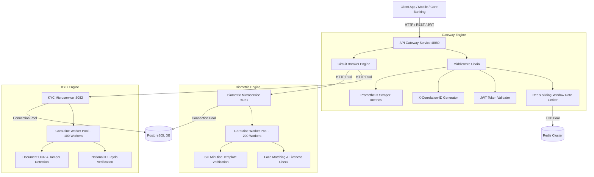

# Enterprise High-Concurrency KYC & Biometric Gateway

[](https://golang.org)
[](https://gofiber.io)
[]()
[](https://www.docker.com)
[](https://github.com)

Production-grade, enterprise microservices backend system engineered for banking & financial environments (Commercial Bank of Ethiopia standard). Designed to handle **thousands of concurrent requests/sec** for National ID validation, passport OCR processing, biometric facial embedding verification, and ISO fingerprint template matching.

---

## 🏛 System Architecture



---

## ⚡ High-Concurrency Engineering Highlights

- **Fiber v2 Framework**: FastHTTP core delivering near zero-memory allocation and low latency routing.
- **Custom Circuit Breaker**: Thread-safe state machine (`Closed`, `Open`, `Half-Open`) preventing cascade failures.
- **Goroutine Worker Pool**: Channel-buffered fixed worker pool handling asynchronous audit logs and heavy biometric operations without blocking client HTTP request routines.
- **Distributed Rate Limiting**: Redis sliding-window rate limiting capable of enforcing client quotas at thousands of requests per second.
- **Parallel Downstream Orchestration**: Goroutine & channel fan-out aggregation (`/api/v1/onboarding/full`) executing KYC validation and Biometric matching concurrently.

---

## 📁 Repository Structure

```
backend/
├── cmd/
│   ├── gateway/                 # API Gateway Entrypoint
│   ├── biometric-service/       # Biometric Microservice Entrypoint
│   └── kyc-service/             # KYC Microservice Entrypoint
├── internal/
│   ├── gateway/                 # Gateway Router, Handlers & Downstream Proxy
│   ├── biometric/               # Biometric Domain, Repo & Worker Engine
│   ├── kyc/                     # KYC National ID & OCR Verification
│   └── platform/                # Shared Infrastructure Modules
│       ├── circuitbreaker/      # Atomic State Machine Circuit Breaker
│       ├── config/              # Centralized Environment Config
│       ├── database/            # GORM PostgreSQL Connection Pool
│       ├── logger/              # Zerolog Structured Logger
│       ├── metrics/             # Prometheus Counters, Histograms & Gauges
│       ├── middleware/          # Rate Limiting, JWT Auth, Correlation IDs
│       ├── redis/               # Redis Client Pool Manager
│       └── workerpool/          # Fixed Goroutine Worker Pool
├── pkg/
│   ├── crypto/                  # AES-256 Encryption & SHA-256 Hashing
│   └── response/                # Standardized JSON API Formatters
├── deployments/
│   ├── docker/
│   │   ├── Dockerfile.gateway
│   │   ├── Dockerfile.biometric
│   │   └── Dockerfile.kyc
│   ├── docker-compose.yml       # Multi-container System Orchestration
│   └── prometheus.yml           # Metrics Scraping Configuration
├── .github/
│   └── workflows/
│       └── ci-cd.yml            # GitHub Actions Pipeline
├── go.mod
├── go.sum
└── README.md
```

---

## 🚀 Quick Start & Deployment

### Environment Requirements
- **Go**: 1.25+
- **Docker & Docker Compose**: Installed and running

### Running with Docker Compose
To launch all services, databases, Redis, and Prometheus monitoring with a single command:

```bash
cd backend
docker-compose -f deployments/docker-compose.yml up --build -d
```

### Verification & Health Endpoint
```bash
curl -i http://localhost:8080/health
```

---

## 🔑 Authentication Flow & API Documentation

### 1. Request OAuth2 Client Credentials Token
```bash
curl -X POST http://localhost:8080/api/v1/auth/login \
  -H "Content-Type: application/json" \
  -d '{
    "client_id": "cbe_partner_app",
    "client_secret": "cbe_partner_secret_key"
  }'
```

**Response:**
```json
{
  "success": true,
  "message": "Authentication successful",
  "data": {
    "access_token": "<JWT_TOKEN>",
    "expires_in": 86400,
    "token_type": "Bearer"
  }
}
```

### 2. Full Parallel Onboarding Endpoint
Orchestrates parallel execution of KYC and Biometric microservices:

```bash
curl -X POST http://localhost:8080/api/v1/onboarding/full \
  -H "Authorization: Bearer <JWT_TOKEN>" \
  -H "Content-Type: application/json" \
  -d '{
    "customer_id": "CBE-987654321",
    "national_id": "ETH-10928374",
    "full_name": "Abebe Bikila",
    "date_of_birth": "1990-05-12",
    "source_image_base64": "aW1hZ2Vfc291cmNlX2Jhc2U2NA==",
    "target_image_base64": "aW1hZ2VfdGFyZ2V0X2Jhc2U2NA=="
  }'
```

### 3. Direct Microservice Proxies
- **KYC Verification**: `POST /api/v1/kyc/verify-national-id`
- **Document OCR**: `POST /api/v1/kyc/document-ocr`
- **Biometric Face Verification**: `POST /api/v1/biometric/verify-face`
- **Fingerprint Verification**: `POST /api/v1/biometric/verify-fingerprint`

### 4. Prometheus Metrics Scraper
```bash
curl http://localhost:8080/metrics
```

---

## 🛠 Local Development & Testing

### Running Tests
```bash
cd backend
go test -v -race ./...
```

### Compiling Binaries Manually
```bash
cd backend
go build -o bin/gateway ./cmd/gateway
go build -o bin/biometric-service ./cmd/biometric-service
go build -o bin/kyc-service ./cmd/kyc-service
```
